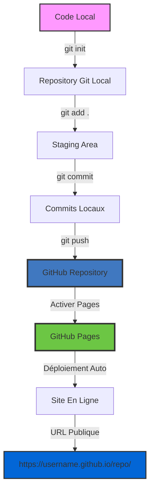
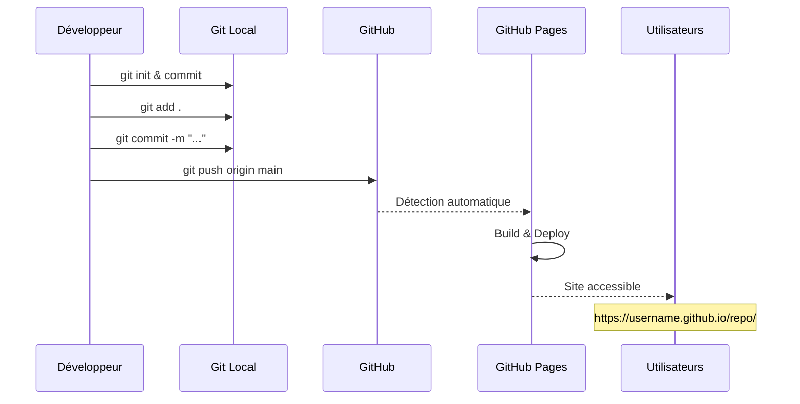
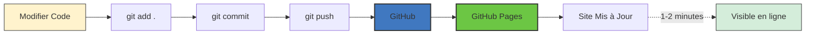
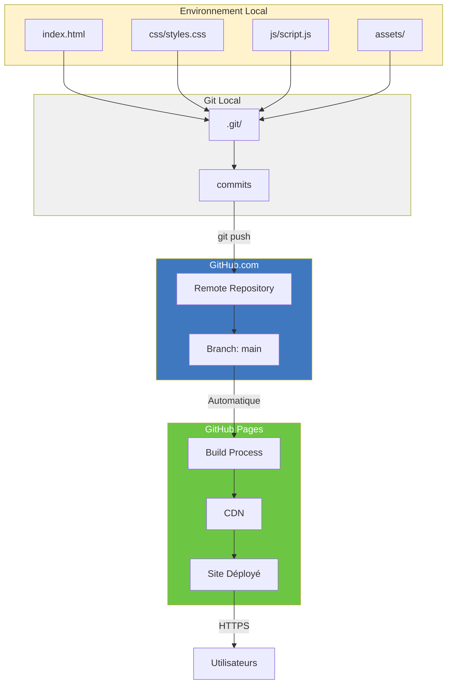

# Guide de Déploiement sur GitHub Pages
## Cours Complet pour Étudiants - Étape par Étape

---

> **Objectif pédagogique**: Apprendre à déployer un site web statique sur GitHub Pages gratuitement
> 
> **Durée estimée**: 20-30 minutes
> 
> **Prérequis**: 
> - Avoir un compte GitHub (gratuit)
> - Avoir Git installé sur votre ordinateur
> - Connaissances de base en ligne de commande

---

## Table des Matières

1. [Qu'est-ce que GitHub Pages?](#1-quest-ce-que-github-pages)
2. [Préparation du Projet](#2-préparation-du-projet)
3. [Création du Dépôt GitHub](#3-création-du-dépôt-github)
4. [Configuration de Git](#4-configuration-de-git)
5. [Push vers GitHub](#5-push-vers-github)
6. [Activation de GitHub Pages](#6-activation-de-github-pages)
7. [Vérification du Déploiement](#7-vérification-du-déploiement)
8. [Mises à Jour du Site](#8-mises-à-jour-du-site)
9. [Dépannage](#9-dépannage)
10. [Bonnes Pratiques](#10-bonnes-pratiques)

---

## Workflow de Déploiement

Voici le processus complet de déploiement sur GitHub Pages:



### Flux Simplifié



---

## 1. Qu'est-ce que GitHub Pages?

### Définition

**GitHub Pages** est un service d'hébergement de sites web statiques gratuit offert par GitHub. Il permet de:

 Héberger des sites HTML/CSS/JavaScript **gratuitement**  
 Obtenir une URL publique automatiquement  
 Bénéficier d'un certificat SSL (HTTPS) gratuit  
 Déployer automatiquement à chaque mise à jour  
 Avoir un contrôle de version complet  

### Cas d'utilisation

- Portfolios personnels
- Documentation de projets
- Landing pages
- Sites vitrines
- Blogs statiques

### Coût

**100% GRATUIT** pour les dépôts publics!

---

## 2. Préparation du Projet

### Structure du Projet

Vérifiez que votre projet a cette structure:

```
portfolio/
 index.html          ← OBLIGATOIRE (point d'entrée)
 css/
    styles.css
 js/
    script.js
 assets/
    images/
        haythem-rehouma.jpg
        haythem-rehouma-1.JPG
 README.md
 LICENSE.md
```

### Points Critiques

1. **Le fichier `index.html` DOIT être à la racine** du projet
2. Tous les chemins doivent être **relatifs** (pas de chemins absolus)
3. Les noms de fichiers sont **sensibles à la casse** sur les serveurs

### Checklist de Préparation

```bash
# Vérifiez que vous êtes dans le bon dossier
cd C:\00-projetsGA\Github-pages

# Listez les fichiers
dir
```

Vous devriez voir:
-  index.html
-  Dossier css/
-  Dossier js/
-  Dossier assets/

---

## 3. Création du Dépôt GitHub

### Étape 3.1: Se connecter à GitHub

1. Allez sur [github.com](https://github.com)
2. Connectez-vous avec votre compte
3. Si vous n'avez pas de compte, cliquez sur **Sign up** (gratuit)

### Étape 3.2: Créer un Nouveau Dépôt

1. Cliquez sur le bouton **"+"** en haut à droite
2. Sélectionnez **"New repository"**


### Étape 3.3: Configuration du Dépôt

Remplissez le formulaire:

| Champ | Valeur Recommandée | Explication |
|-------|-------------------|-------------|
| **Repository name** | `portfolio-haythem-rehouma` | Nom unique, sans espaces |
| **Description** | `Portfolio professionnel de Haythem REHOUMA - AI Developer` | Description claire |
| **Visibility** |  **Public** | Obligatoire pour GitHub Pages gratuit |
| **Initialize** |  **PAS** de README | On va pusher notre code existant |
| **Add .gitignore** |  **Non** | On a déjà le nôtre |
| **Choose a license** |  **Non** | On a déjà LICENSE.md |

### Exemple de Configuration

```
Repository name: portfolio-haythem-rehouma
Description: Portfolio professionnel - Développeur IA spécialisé en Prompt Engineering
 Public
 Add a README file
 Add .gitignore
 Choose a license
```

4. Cliquez sur **"Create repository"**

---

## 4. Configuration de Git

### Étape 4.1: Initialiser Git (si pas déjà fait)

Ouvrez **PowerShell** ou **Git Bash** dans votre dossier de projet:

```powershell
# Naviguez vers votre projet
cd C:\00-projetsGA\Github-pages

# Initialisez Git
git init
```

**Résultat attendu:**
```
Initialized empty Git repository in C:/00-projetsGA/Github-pages/.git/
```

### Étape 4.2: Configurer votre Identité Git (première fois seulement)

```powershell
# Configurez votre nom
git config --global user.name "Haythem REHOUMA"

# Configurez votre email (utilisez l'email de votre compte GitHub)
git config --global user.email "haythem.rehouma@inskillflow.com"

# Vérifiez la configuration
git config --list
```

### Étape 4.3: Préparer les Fichiers

```powershell
# Ajoutez TOUS les fichiers au staging
git add .

# Vérifiez les fichiers ajoutés (doit être en vert)
git status
```

**Résultat attendu:**
```
On branch main

No commits yet

Changes to be committed:
  (use "git rm --cached <file>..." to unstage)
        new file:   index.html
        new file:   css/styles.css
        new file:   js/script.js
        new file:   assets/images/haythem-rehouma.jpg
        ...
```

### Étape 4.4: Premier Commit

```powershell
# Créez le premier commit
git commit -m "Initial commit - Portfolio Haythem REHOUMA by inskillflow"
```

**Résultat attendu:**
```
[main (root-commit) a1b2c3d] Initial commit - Portfolio Haythem REHOUMA by inskillflow
 15 files changed, 2847 insertions(+)
 create mode 100644 index.html
 create mode 100644 css/styles.css
 ...
```

---

## 5. Push vers GitHub

### Étape 5.1: Lier le Dépôt Local au Dépôt GitHub

Retournez sur la page de votre dépôt GitHub fraîchement créé. Vous verrez des instructions. Utilisez celles-ci:

```powershell
# Renommez la branche en 'main' (standard moderne)
git branch -M main

# Ajoutez le dépôt distant (remote)
# REMPLACEZ 'VOTRE-USERNAME' par votre nom d'utilisateur GitHub
git remote add origin https://github.com/VOTRE-USERNAME/portfolio-haythem-rehouma.git

# Vérifiez que c'est bien configuré
git remote -v
```

**Résultat attendu:**
```
origin  https://github.com/VOTRE-USERNAME/portfolio-haythem-rehouma.git (fetch)
origin  https://github.com/VOTRE-USERNAME/portfolio-haythem-rehouma.git (push)
```

### Étape 5.2: Pousser le Code

```powershell
# Poussez votre code vers GitHub
git push -u origin main
```

**Lors du premier push, GitHub vous demandera de vous authentifier:**

#### Option A: Personal Access Token (Recommandé)

1. Allez dans **Settings** > **Developer settings** > **Personal access tokens** > **Tokens (classic)**
2. Cliquez sur **"Generate new token"**
3. Donnez un nom: `Portfolio Deployment`
4. Sélectionnez les permissions: `repo` (toutes les sous-options)
5. Cliquez sur **"Generate token"**
6. **COPIEZ LE TOKEN IMMÉDIATEMENT** (vous ne pourrez plus le voir!)
7. Utilisez ce token comme mot de passe lors du push

#### Option B: GitHub CLI

```powershell
# Installez GitHub CLI si pas déjà fait
winget install --id GitHub.cli

# Authentifiez-vous
gh auth login

# Suivez les instructions interactives
```

**Résultat attendu après le push:**
```
Enumerating objects: 25, done.
Counting objects: 100% (25/25), done.
Delta compression using up to 8 threads
Compressing objects: 100% (23/23), done.
Writing objects: 100% (25/25), 145.67 KiB | 7.28 MiB/s, done.
Total 25 (delta 2), reused 0 (delta 0), pack-reused 0
To https://github.com/VOTRE-USERNAME/portfolio-haythem-rehouma.git
 * [new branch]      main -> main
Branch 'main' set up to track remote branch 'main' from 'origin'.
```

### Étape 5.3: Vérification

Rechargez la page de votre dépôt GitHub. Vous devriez voir tous vos fichiers!

---

## 6. Activation de GitHub Pages

### Étape 6.1: Accéder aux Paramètres

1. Sur la page de votre dépôt GitHub
2. Cliquez sur l'onglet **"Settings"** ( Paramètres)
3. Dans le menu de gauche, cherchez **"Pages"**

### Étape 6.2: Configuration de GitHub Pages

Dans la section **"Build and deployment"**:

| Paramètre | Valeur |
|-----------|--------|
| **Source** | Deploy from a branch |
| **Branch** | `main` |
| **Folder** | `/ (root)` |

Cliquez sur **"Save"**

### ⏱ Étape 6.3: Attendre le Déploiement

GitHub Pages va maintenant:
1.  Analyser votre code
2.  Construire le site
3.  Le déployer sur leurs serveurs

**Temps d'attente**: 30 secondes à 5 minutes

### Étape 6.4: Récupérer l'URL

Une fois le déploiement terminé, vous verrez un message en haut:

```
 Your site is live at https://VOTRE-USERNAME.github.io/portfolio-haythem-rehouma/
```

**C'EST L'URL DE VOTRE SITE!** 

---

## 7. Vérification du Déploiement

### Checklist de Vérification

Visitez votre site et vérifiez:

- [ ] La page s'affiche correctement
- [ ] Les styles CSS sont chargés
- [ ] Le JavaScript fonctionne (chatbot, animations)
- [ ] Les images s'affichent
- [ ] Le responsive fonctionne (testez sur mobile)
- [ ] Le chatbot fonctionne
- [ ] Le formulaire de contact est visible
- [ ] Les liens fonctionnent

### Si quelque chose ne fonctionne pas

1. Ouvrez la **Console du navigateur** (F12)
2. Regardez l'onglet **"Console"** pour les erreurs
3. Regardez l'onglet **"Network"** pour voir si les fichiers se chargent

**Erreurs communes:**

| Erreur | Cause | Solution |
|--------|-------|----------|
| `404 Not Found` pour CSS/JS | Chemin incorrect | Vérifiez que les chemins sont relatifs |
| Images cassées | Extension de fichier mal nommée | Vérifiez `.jpg` vs `.JPG` |
| Page blanche | Erreur JavaScript | Vérifiez la console |

---

## 8. Mises à Jour du Site

### Diagramme du Cycle de Mise à Jour



### Workflow de Mise à Jour

Chaque fois que vous modifiez votre site:

```powershell
# 1. Vérifiez les fichiers modifiés
git status

# 2. Ajoutez les modifications
git add .

# 3. Créez un commit avec un message descriptif
git commit -m "Ajout d'une nouvelle section projets"

# 4. Poussez vers GitHub
git push

# GitHub Pages se met à jour automatiquement en 1-2 minutes!
```

### Bonnes Pratiques pour les Messages de Commit

** Mauvais:**
```bash
git commit -m "modif"
git commit -m "update"
git commit -m "fix"
```

** Bon:**
```bash
git commit -m "Ajout de la section témoignages"
git commit -m "Correction du bug du chatbot sur mobile"
git commit -m "Mise à jour de la photo de profil"
git commit -m "Optimisation des performances des images"
```

### Template de Message de Commit

```
Type: Description courte (max 50 caractères)

- Détail 1
- Détail 2
- Détail 3

Exemples de types:
- feat: Nouvelle fonctionnalité
- fix: Correction de bug
- style: Changements CSS
- docs: Mise à jour documentation
- refactor: Refactorisation du code
```

---

## 9. Dépannage

### Problème: Le site ne se déploie pas

**Solution:**

```powershell
# Vérifiez le statut du déploiement
# Allez sur: https://github.com/VOTRE-USERNAME/portfolio-haythem-rehouma/actions
```

Vous verrez l'historique des déploiements. Cliquez sur le dernier pour voir les erreurs.

### Problème: 404 Page Not Found

**Causes possibles:**

1. **index.html n'est pas à la racine**
   ```powershell
   # Vérifiez la structure
   git ls-files
   ```

2. **Le dépôt est privé**
- GitHub Pages gratuit nécessite un dépôt **public**

3. **GitHub Pages n'est pas activé**
- Revérifiez Settings > Pages

### Problème: Les images ne s'affichent pas

**Solution:**

```html
<!--  Mauvais (chemin absolu) -->


<!--  Bon (chemin relatif) -->


```

### Problème: CSS/JS ne se charge pas

**Vérifiez les chemins dans index.html:**

```html
<!--  Correct -->
<link rel="stylesheet" href="css/styles.css">
<script src="js/script.js"></script>

<!--  Incorrect -->
<link rel="stylesheet" href="/css/styles.css">
<script src="script.js"></script>
```

---

## 10. Bonnes Pratiques

### Pour les Étudiants

1. **Commitez souvent** - Petit commits > gros commits
2. **Messages clairs** - Décrivez ce que vous avez fait
3. **Testez localement** - Avant de pusher
4. **Utilisez .gitignore** - N'envoyez pas de fichiers inutiles
5. **Documentez** - README.md à jour

### Sécurité

1. **Ne commitez JAMAIS:**
- Mots de passe
- Clés API
- Tokens d'accès
- Informations personnelles sensibles

2. **Utilisez .gitignore pour:**
   ```gitignore
   .env
   .env.local
   config.json
   secrets/
   ```

### Performance

1. **Optimisez les images:**
- Compressez avec [TinyPNG](https://tinypng.com/)
- Max 500KB par image
- Utilisez WebP si possible

2. **Minifiez le code** (optionnel pour production):
   ```bash
   # CSS
   npm install -g clean-css-cli
   cleancss -o css/styles.min.css css/styles.css
   
   # JS
   npm install -g terser
   terser js/script.js -o js/script.min.js
   ```

---

## Architecture Complète



---

## Résumé - Commandes Essentielles

```powershell
# Configuration initiale (une seule fois)
git init
git config --global user.name "Votre Nom"
git config --global user.email "votre@email.com"
git add .
git commit -m "Initial commit"
git branch -M main
git remote add origin https://github.com/USERNAME/REPO.git
git push -u origin main

# Mises à jour régulières
git add .
git commit -m "Description des changements"
git push
```

---

## Ressources Complémentaires

### Documentation Officielle
- [GitHub Pages Documentation](https://docs.github.com/pages)
- [Git Documentation](https://git-scm.com/doc)

### Tutoriels
- [GitHub Learning Lab](https://lab.github.com/)
- [Git Immersion](http://gitimmersion.com/)

### Outils
- [GitHub Desktop](https://desktop.github.com/) - Interface graphique pour Git
- [Git Kraken](https://www.gitkraken.com/) - Client Git avancé
- [VS Code Git Integration](https://code.visualstudio.com/docs/editor/versioncontrol)

---

## Exercice Pratique pour les Étudiants

### Mission 1: Déploiement Initial (30 min)
1. Créez un compte GitHub
2. Créez un nouveau dépôt
3. Pushez votre portfolio
4. Activez GitHub Pages
5. Partagez l'URL avec le professeur

### Mission 2: Première Mise à Jour (15 min)
1. Modifiez la couleur du thème dans `css/styles.css`
2. Changez une statistique dans la section Hero
3. Commitez et pushez
4. Vérifiez que le site est mis à jour

### Mission 3: Debugging (20 min)
1. Cassez volontairement un lien CSS
2. Pushez et observez l'erreur
3. Réparez et re-poussez
4. Documentez le processus dans un fichier `DEBUG-LOG.md`

---

## Critères d'Évaluation

| Critère | Points |
|---------|--------|
| Site accessible en ligne | 20 |
| Tous les fichiers chargent correctement | 20 |
| Messages de commit clairs | 15 |
| Structure de projet propre | 15 |
| README.md à jour | 10 |
| Responsive fonctionne | 10 |
| Pas de fichiers inutiles | 10 |
| **Total** | **100** |

---

## Questions Fréquentes des Étudiants

**Q: Puis-je utiliser un nom de domaine personnalisé?**  
R: Oui! GitHub Pages supporte les domaines personnalisés. Voir [Custom Domain Documentation](https://docs.github.com/pages/configuring-a-custom-domain-for-your-github-pages-site).

**Q: Combien de sites puis-je héberger?**  
R: Un site par dépôt, illimité de dépôts publics.

**Q: Puis-je utiliser PHP ou une base de données?**  
R: Non, GitHub Pages est pour sites **statiques** uniquement (HTML/CSS/JS).

**Q: Comment supprimer mon site?**  
R: Settings > Pages > Désactivez GitHub Pages, ou supprimez le dépôt.

---

© 2024 **Haythem REHOUMA** - Powered by **inskillflow**

**Guide pédagogique pour le cours de développement web**

---

## Prochaine Étape

Passez au [Guide de Déploiement Vercel](GUIDE-DEPLOIEMENT-VERCEL.md) pour apprendre une méthode alternative!

