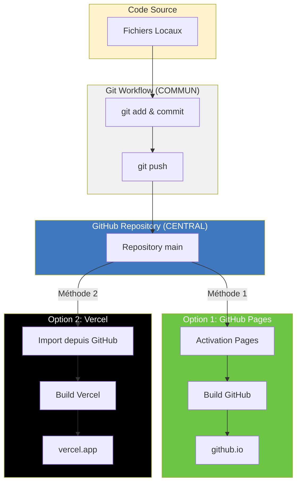
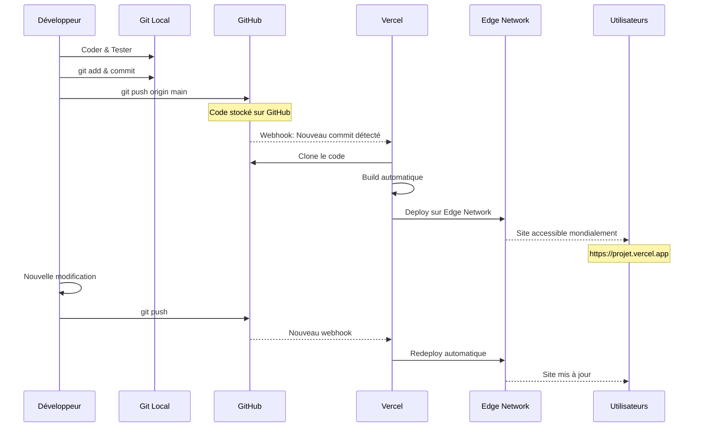
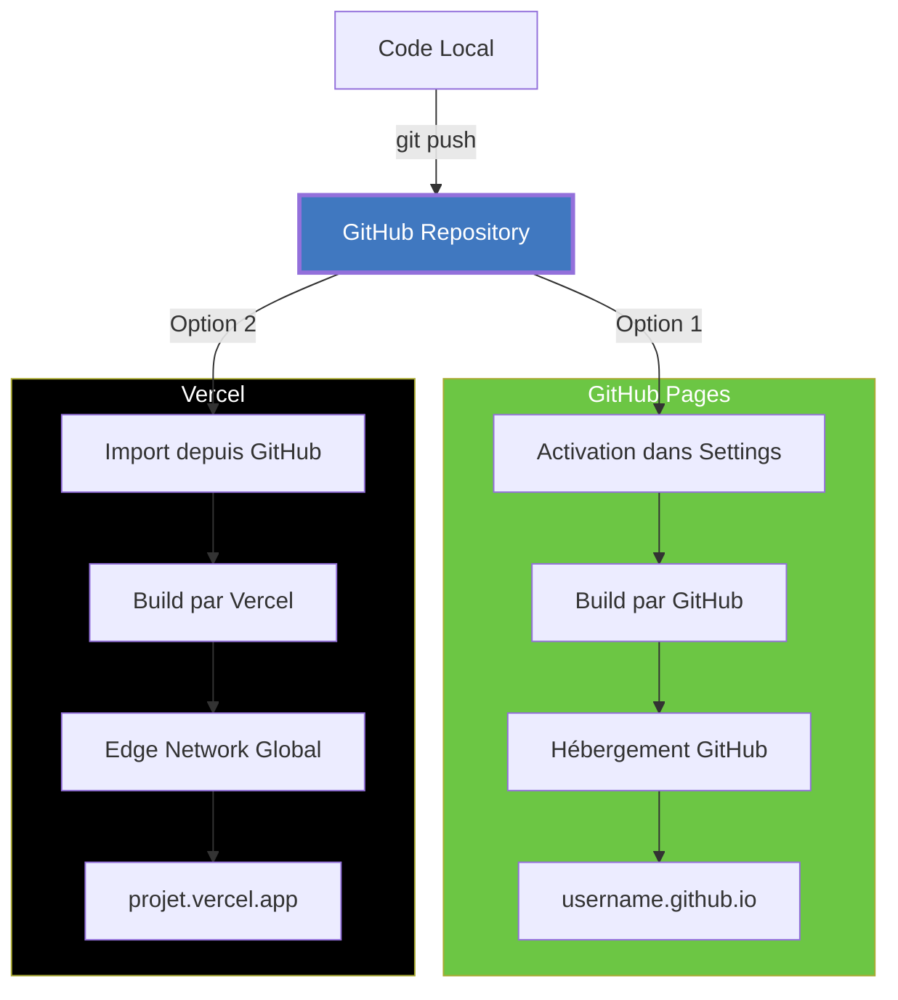
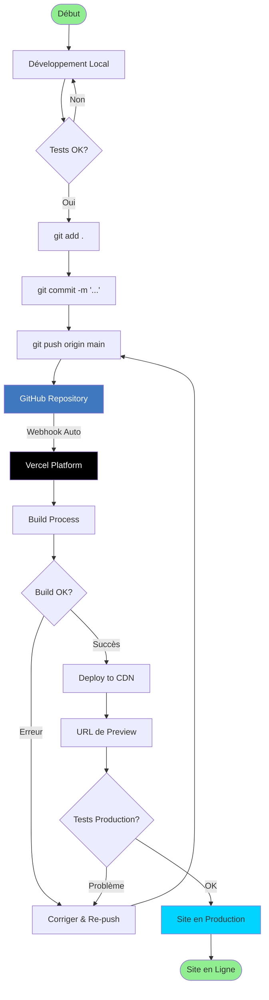

# Guide de Déploiement sur Vercel
## Cours Complet pour Étudiants - Étape par Étape

---

> **Objectif pédagogique**: Apprendre à déployer un site web statique sur Vercel avec déploiement continu
> 
> **Durée estimée**: 15-20 minutes
> 
> **Prérequis**: 
> - Avoir un compte GitHub avec votre code déjà push é (voir [Guide GitHub Pages](GUIDE-DEPLOIEMENT-GITHUB-PAGES.md))
> - OU avoir les fichiers sur votre ordinateur
> 
> **Niveau**: Débutant à Intermédiaire

---

## Table des Matières

1. [Qu'est-ce que Vercel?](#1-quest-ce-que-vercel)
2. [Méthode 1: Import depuis GitHub](#2-méthode-1-import-depuis-github)
3. [Méthode 2: Déploiement par Drag & Drop](#3-méthode-2-déploiement-par-drag--drop)
4. [Méthode 3: Vercel CLI (Ligne de Commande)](#4-méthode-3-vercel-cli-ligne-de-commande)
5. [Configuration Personnalisée](#5-configuration-personnalisée)
6. [Nom de Domaine Personnalisé](#6-nom-de-domaine-personnalisé)
7. [Variables d'Environnement](#7-variables-denvironnement)
8. [Dépannage](#8-dépannage)
9. [Comparaison Vercel vs GitHub Pages](#9-comparaison-vercel-vs-github-pages)
10. [Bonnes Pratiques](#10-bonnes-pratiques)

---

## Workflow de Déploiement Vercel

### Le code passe TOUJOURS par GitHub d'abord!

```mermaid
graph TD
    A[Code Local] -->|git init| B[Repository Git Local]
    B -->|git add & commit| C[Commits Locaux]
    C -->|git push| D[GitHub Repository]
    D -->|Connexion Vercel| E[Vercel Platform]
    E -->|Import Auto| F[Build Process]
    F -->|Deploy| G[Edge Network CDN]
    G -->|URL Publique| H[https://projet.vercel.app]
    
    D -.->|Alternative| I[GitHub Pages]
    
    style A fill:#f9f,stroke:#333,stroke-width:2px
    style D fill:#4078c0,stroke:#333,stroke-width:3px
    style E fill:#000,stroke:#333,stroke-width:3px
    style G fill:#0070f3,stroke:#333,stroke-width:2px
    style H fill:#00d4ff,stroke:#333,stroke-width:2px
```



### Comparaison des Flux: GitHub Pages vs Vercel



### Flux Détaillé avec CI/CD



---

## 1. Qu'est-ce que Vercel?

### Définition

**Vercel** est une plateforme de déploiement cloud optimisée pour les frameworks frontend modernes. Créée par l'équipe derrière **Next.js**.

### Avantages de Vercel

| Fonctionnalité | Description |
|----------------|-------------|
|  **Déploiement Instantané** | Deploy en quelques secondes |
|  **CI/CD Automatique** | Chaque commit = nouveau déploiement |
|  **CDN Global** | Edge Network dans le monde entier |
|  **Analytics Intégrés** | Statistiques de performance |
|  **SSL Automatique** | HTTPS gratuit |
|  **Preview Deployments** | URL unique pour chaque PR |
|  **Performances** | Optimisation automatique |
|  **Plan Gratuit Généreux** | 100 GB bande passante/mois |

### Tarification

**Plan Hobby (Gratuit):**
-  Projets illimités
-  100 GB bande passante/mois  
-  SSL automatique
-  Analytics de base
-  Domaines personnalisés

**Plan Pro (20$/mois):**
-  Tout du plan Hobby
-  1 TB bande passante
-  Analytics avancés
-  Support prioritaire

### Quand Utiliser Vercel?

 **Utilisez Vercel si:**
- Vous voulez les meilleures performances
- Vous avez besoin de preview deployments
- Vous travaillez en équipe
- Vous voulez des analytics
- Vous utilisez Next.js, React, Vue, etc.

 **Utilisez GitHub Pages si:**
- Vous débutez complètement
- Vous voulez 100% gratuit et illimité
- Vous n'avez besoin que d'un hébergement simple
- Vous voulez comprendre Git en profondeur

---

## 2. Méthode 1: Import depuis GitHub

### Méthode Recommandée pour les Projets Professionnels (CI/CD)


Cette méthode permet un **déploiement continu automatique** : chaque fois que vous poussez du code vers GitHub, Vercel redéploie automatiquement votre site!

**IMPORTANT:** Le code doit TOUJOURS être sur GitHub en premier!

### Étape 2.1: Créer un Compte Vercel

1. Allez sur [vercel.com](https://vercel.com)
2. Cliquez sur **"Sign Up"**
3. Choisissez **"Continue with GitHub"** (recommandé)
4. Autorisez Vercel à accéder à vos dépôts GitHub

### Étape 2.2: Importer le Projet

1. Sur votre dashboard Vercel, cliquez sur **"Add New..."**
2. Sélectionnez **"Project"**
3. Vous verrez la liste de vos dépôts GitHub
4. Cherchez `portfolio-haythem-rehouma`
5. Cliquez sur **"Import"**

### Étape 2.3: Configuration du Projet

Vercel va détecter automatiquement votre configuration:

```
Project Name: portfolio-haythem-rehouma
Framework Preset: Other
Root Directory: ./
Build Command: (laisser vide)
Output Directory: (laisser vide)
Install Command: (laisser vide)
```

**Pour un site HTML statique, laissez tout par défaut!**

### Étape 2.4: Déployer

1. Cliquez sur **"Deploy"**
2. Vercel va:
-  Cloner votre code
-  L'analyser
-  Le déployer sur le CDN global
-  Générer une URL

**Temps de déploiement:** 10-30 secondes 

### Étape 2.5: Récupérer l'URL

Une fois terminé, vous verrez:

```
 Congratulations!
Your project has been successfully deployed.

Visit: https://portfolio-haythem-rehouma.vercel.app
```

**C'est l'URL de votre site!** 

---

## 3. Méthode 2: Déploiement par Drag & Drop

### Parfait pour: Démo Rapide, Prototypes

### Étape 3.1: Préparer les Fichiers

```powershell
# Allez dans votre dossier de projet
cd C:\00-projetsGA\Github-pages

# Assurez-vous d'avoir tous les fichiers nécessaires
dir
```

### Étape 3.2: Créer un Projet

1. Allez sur [vercel.com/new](https://vercel.com/new)
2. Sélectionnez **"Browse"** sous "Deploy from a Git repository"
3. Ou descendez et cherchez **"Deploy with Vercel CLI"**

### Étape 3.3: Drag & Drop

1. Sélectionnez **TOUT** le dossier de votre projet (pas les fichiers individuels!)
2. Glissez-déposez dans la zone

### Étape 3.4: Déploiement

Vercel va automatiquement:
-  Uploader vos fichiers
-  Les analyser
-  Les déployer

**Temps:** 10-20 secondes

### Limitation

 Pas de déploiement automatique  
 Pas de lien avec Git  
 Vous devez re-déployer manuellement à chaque modification

---

## 4. Méthode 3: Vercel CLI (Ligne de Commande)

### Pour les Étudiants Avancés

Cette méthode est parfaite pour:
-  Automatisation
-  Intégration dans des scripts
-  Déploiement depuis CI/CD

### Étape 4.1: Installer Vercel CLI

```powershell
# Avec npm (nécessite Node.js)
npm install -g vercel

# Ou avec pnpm
pnpm add -g vercel

# Ou avec yarn
yarn global add vercel
```

**Vérifiez l'installation:**

```powershell
vercel --version
```

**Résultat attendu:**
```
Vercel CLI 32.5.0
```

### Étape 4.2: S'authentifier

```powershell
vercel login
```

Vercel va:
1. Ouvrir votre navigateur
2. Vous demander de vous connecter
3. Confirmer l'authentification

**Résultat:**
```
> Success! Email authentication complete for haythem.rehouma@inskillflow.com
```

### Étape 4.3: Déployer

```powershell
# Naviguez vers votre projet
cd C:\00-projetsGA\Github-pages

# Déployez!
vercel
```

Vercel va poser des questions:

```
? Set up and deploy "C:\00-projetsGA\Github-pages"? [Y/n] y
? Which scope do you want to deploy to? Your Username
? Link to existing project? [y/N] n
? What's your project's name? portfolio-haythem-rehouma
? In which directory is your code located? ./
```

**Répondez:**
- Y (yes) pour setup
- Votre username
- N (nouveau projet)
- `portfolio-haythem-rehouma`
- `./` (répertoire actuel)

### Étape 4.4: Résultat

```
 Deployed to production. Run `vercel --prod` to overwrite later.
  Inspect: https://vercel.com/...
  Preview: https://portfolio-haythem-rehouma-abc123.vercel.app
```

### Mises à Jour Futures

```powershell
# Modifiez vos fichiers...

# Puis re-déployez
vercel --prod
```

**C'est tout!** Le site se met à jour instantanément.

---

## 5. Configuration Personnalisée

### Fichier vercel.json

Créez un fichier `vercel.json` à la racine de votre projet pour personnaliser le déploiement:

```json
{
  "version": 2,
  "name": "portfolio-haythem-rehouma",
  "builds": [
    {
      "src": "index.html",
      "use": "@vercel/static"
    }
  ],
  "routes": [
    {
      "src": "/(.*)",
      "dest": "/$1"
    }
  ],
  "headers": [
    {
      "source": "/(.*)",
      "headers": [
        {
          "key": "X-Content-Type-Options",
          "value": "nosniff"
        },
        {
          "key": "X-Frame-Options",
          "value": "DENY"
        },
        {
          "key": "X-XSS-Protection",
          "value": "1; mode=block"
        }
      ]
    }
  ]
}
```

### Options Utiles

#### Redirections

```json
{
  "redirects": [
    {
      "source": "/old-page",
      "destination": "/new-page",
      "permanent": true
    }
  ]
}
```

#### Rewrites (URLs propres)

```json
{
  "rewrites": [
    {
      "source": "/about",
      "destination": "/index.html#about"
    }
  ]
}
```

#### Cache Headers

```json
{
  "headers": [
    {
      "source": "/assets/(.*)",
      "headers": [
        {
          "key": "Cache-Control",
          "value": "public, max-age=31536000, immutable"
        }
      ]
    }
  ]
}
```

---

## 6. Nom de Domaine Personnalisé

### Ajouter Votre Propre Domaine

#### Étape 6.1: Acheter un Domaine

Achetez un domaine sur:
- [Vercel Domains](https://vercel.com/domains) - Intégration directe avec Vercel
- [Namecheap](https://namecheap.com) - Prix compétitifs, interface simple
- [GoDaddy](https://godaddy.com) - Très populaire, support 24/7
- [Google Domains](https://domains.google) - Interface Google, fiable
- [OVH](https://ovh.com) - Hébergeur français, bon support
- [Hostinger](https://hostinger.com) - Très bon rapport qualité/prix
- [Cloudflare](https://cloudflare.com) - Prix au coût, excellente sécurité
- [Gandi](https://gandi.net) - Français, éthique, sans frais cachés

**Prix moyen:** $10-15/an (environ 10-14€/an)

**Recommandations:**
- **Pour débutants:** Namecheap ou Hostinger (interface simple)
- **Pour Vercel:** Vercel Domains (intégration native)
- **Pour sécurité:** Cloudflare (protection DDoS incluse)
- **Pour français:** OVH ou Gandi (support en français)

#### Étape 6.2: Ajouter le Domaine à Vercel

1. Allez dans votre projet sur Vercel
2. **Settings** > **Domains**
3. Cliquez sur **"Add"**
4. Entrez votre domaine: `haythem-rehouma.com`
5. Cliquez sur **"Add"**

#### Étape 6.3: Configurer le DNS

Vercel vous donnera des instructions. Généralement:

**Option A: Nameservers (Recommandé)**

```
ns1.vercel-dns.com
ns2.vercel-dns.com
```

Changez les nameservers chez votre registrar.

**Option B: A Record**

```
Type: A
Name: @
Value: 76.76.21.21
```

**Option C: CNAME**

```
Type: CNAME
Name: www
Value: cname.vercel-dns.com
```

#### Étape 6.4: Attendre la Propagation

⏱ **Temps d'attente:** 15 minutes à 48 heures (généralement 1-2 heures)

 Une fois configuré, votre site sera accessible sur:
- `https://haythem-rehouma.com`
- `https://www.haythem-rehouma.com`

---

## 7. Variables d'Environnement

### Pour les Secrets et Configuration

Si vous avez besoin de clés API (pour un chatbot réel, par exemple):

#### Étape 7.1: Ajouter des Variables

1. Projet Vercel > **Settings** > **Environment Variables**
2. Cliquez sur **"Add"**
3. Remplissez:

```
Name: OPENAI_API_KEY
Value: sk-abc123...
Environment: Production, Preview, Development
```

4. Cliquez sur **"Save"**

#### Étape 7.2: Utiliser dans le Code

```javascript
// Dans votre JS (côté serveur uniquement!)
const apiKey = process.env.OPENAI_API_KEY;
```

 **IMPORTANT:** Les variables d'environnement ne fonctionnent que dans les **Serverless Functions**, pas dans le HTML/JS statique!

---

## 8. Dépannage

### Problème: Build Failed

**Erreur:**
```
Error: Build failed with exit code 1
```

**Solutions:**

1. **Vérifiez les logs de build:**
- Cliquez sur le déploiement échoué
- Regardez **"Build Logs"**

2. **Vérifiez la structure du projet:**
   ```powershell
   # index.html doit être à la racine
   ls
   ```

3. **Vérifiez les chemins relatifs:**
   ```html
   <!--  Bon -->
   <link href="css/styles.css">
   
   <!--  Mauvais -->
   <link href="/css/styles.css">
   ```

### Problème: 404 Not Found

**Solutions:**

1. **Ajoutez un fichier vercel.json:**
   ```json
   {
     "routes": [
       { "handle": "filesystem" },
       { "src": "/(.*)", "dest": "/index.html" }
     ]
   }
   ```

2. **Vérifiez que index.html existe:**
   ```powershell
   ls index.html
   ```

### Problème: Domaine ne se connecte pas

**Solutions:**

1. **Vérifiez la propagation DNS:**
   ```powershell
   nslookup votre-domaine.com
   ```

2. **Utilisez un outil en ligne:**
- [whatsmydns.net](https://whatsmydns.net)
- Entrez votre domaine
- Vérifiez si les DNS pointent vers Vercel

3. **Attendez plus longtemps** (parfois 48h)

### Problème: Le site ne se met pas à jour

**Solutions:**

1. **Forcez un rebuild:**
   ```powershell
   # Avec CLI
   vercel --prod --force
   ```

2. **Videz le cache du navigateur:**
- Chrome/Edge: Ctrl + Shift + R
- Firefox: Ctrl + F5

3. **Vérifiez le dernier commit:**
- Dashboard Vercel
- Vérifiez que c'est le bon commit qui est déployé

---

## 9. Comparaison Vercel vs GitHub Pages

### Architecture: Les Deux Utilisent GitHub!



### Tableau Comparatif

| Critère | Vercel | GitHub Pages |
|---------|--------|--------------|
| Vitesse de déploiement | 10-30 sec | 30-300 sec |
| CDN Global | Edge Network mondial | GitHub CDN |
| Coût | 100 GB/mois gratuit | Illimité gratuit |
| CI/CD | Automatique | Automatique |
| Analytics | Intégrés (gratuit) | Non (sauf avec Google Analytics) |
| Preview Deployments | Oui | Non |
| Serverless Functions | Oui | Non |
| Configuration | vercel.json puissant | Limited |
| Facilité d'utilisation | Très Facile | Facile |
| Courbe d'apprentissage | Facile | Moyenne (Git requis) |
| Usage Professionnel | Excellence | Bon |

### Recommandation pour les Étudiants

**Apprenez les DEUX!**

1. **Commencez par GitHub Pages** pour comprendre Git
2. **Passez à Vercel** pour des projets plus avancés

---

## 10. Bonnes Pratiques

### DO - À Faire

1. **Utilisez Git pour tout projet Vercel**
- Même si vous utilisez le CLI
- Facilite le rollback

2. **Configurez des Environments**
- Production
- Preview (pour les PRs)
- Development

3. **Utilisez vercel.json pour la configuration**
- Redirects
- Headers
- Rewrites

4. **Testez localement d'abord**
   ```powershell
   # Serveur local
   python -m http.server 8000
   ```

5. **Surveillez vos quotas**
- Dashboard > Usage
- 100 GB/mois en gratuit

### DON'T - À Éviter

1. **Ne commitez jamais de secrets**
- Utilisez les Environment Variables de Vercel

2. **N'utilisez pas Drag & Drop pour la production**
- Réservez ça aux prototypes

3. **Ne déployez pas depuis des branches de développement**
- Créez une branche `main` stable

4. **Ne surchargez pas la bande passante**
- Optimisez les images
- Utilisez la compression

---

## Workflow Recommandé

### Processus Complet: Local → GitHub → Vercel



### Étapes Résumées

```
1. Développement Local
   ↓
2. Commit et Push vers GitHub (OBLIGATOIRE)
   ↓
3. Vercel détecte le push (Webhook)
   ↓
4. Build automatique
   ↓
5. Déploiement sur Edge CDN
   ↓
6. Site accessible mondialement
```

### Commandes Git + Vercel

```powershell
# 1. Développez votre feature
# ... modifiez les fichiers ...

# 2. Commitez
git add .
git commit -m "feat: Ajout du module analytics"

# 3. Pushez
git push

# 4. Vercel déploie automatiquement!
# Vous recevez une notification avec l'URL

# 5. Vérifiez le déploiement
vercel ls

# 6. Si besoin, inspectez
vercel inspect [deployment-url]
```

---

## Exercices Pratiques pour les Étudiants

### Exercice 1: Déploiement de Base (20 min)
1. Créez un compte Vercel
2. Importez votre projet depuis GitHub
3. Déployez et partagez l'URL
4. Faites une modification et observez le redéploiement automatique

### Exercice 2: Configuration Avancée (30 min)
1. Créez un fichier `vercel.json`
2. Ajoutez des headers de sécurité
3. Configurez une redirection
4. Testez que tout fonctionne

### Exercice 3: Domaine Personnalisé (45 min)
1. Achetez un domaine sur Namecheap (~$1 première année avec promo) ou Hostinger
2. Configurez-le sur Vercel
3. Attendez la propagation DNS
4. Vérifiez que HTTPS fonctionne

### Exercice 4: Comparaison (60 min)
1. Déployez le même site sur Vercel ET GitHub Pages
2. Comparez les performances avec [GTmetrix](https://gtmetrix.com)
3. Documentez les différences dans un fichier `COMPARISON.md`
4. Présentez vos conclusions

---

## Ressources Complémentaires

### Documentation Officielle
- [Vercel Documentation](https://vercel.com/docs)
- [Vercel CLI Reference](https://vercel.com/docs/cli)
- [vercel.json Configuration](https://vercel.com/docs/project-configuration)

### Tutoriels Vidéo
- [Vercel Crash Course](https://www.youtube.com/results?search_query=vercel+tutorial)
- [Next.js + Vercel](https://www.youtube.com/results?search_query=nextjs+vercel)

### Outils
- [Vercel CLI](https://vercel.com/cli)
- [Vercel for GitHub](https://vercel.com/github)
- [Vercel Analytics](https://vercel.com/analytics)

---

## Checklist de Déploiement

Avant de déployer:

- [ ] Tous les fichiers sont commitée
- [ ] index.html est à la racine
- [ ] Tous les chemins sont relatifs
- [ ] Images optimisées (<500KB)
- [ ] Testé localement
- [ ] Pas de secrets dans le code
- [ ] README.md à jour
- [ ] .gitignore configuré

Après déploiement:

- [ ] Site accessible
- [ ] Toutes les pages fonctionnent
- [ ] CSS/JS chargent correctement
- [ ] Images s'affichent
- [ ] Responsive testé
- [ ] HTTPS activé
- [ ] Performance testée (Lighthouse)

---

## Points Clés à Retenir

1.  **Vercel est RAPIDE** - Déploiement en secondes
2.  **CI/CD automatique** - Push = Deploy
3.  **CDN Global** - Performances mondiales
4.  **Gratuit pour commencer** - Plan Hobby généreux
5.  **Analytics inclus** - Suivez vos performances
6.  **Preview Deployments** - Testez avant de merger
7.  **Serverless Ready** - Évoluez facilement

---

## Quiz de Compréhension

1. Quelle est la différence principale entre Vercel et GitHub Pages?
2. Comment déployer automatiquement à chaque commit?
3. Que contient le fichier `vercel.json`?
4. Comment ajouter un domaine personnalisé?
5. Où stocker les clés API sensibles?

**Réponses:** Voir les sections correspondantes du guide!

---

## Critères d'Évaluation

| Critère | Points |
|---------|--------|
| Déploiement réussi | 25 |
| CI/CD configuré | 20 |
| vercel.json présent et valide | 15 |
| Performance (Lighthouse > 90) | 15 |
| Documentation dans README | 10 |
| HTTPS fonctionnel | 10 |
| Responsive vérifié | 5 |
| **Total** | **100** |

---

## Support

**Besoin d'aide?**

1. **Documentation Vercel:** [vercel.com/docs](https://vercel.com/docs)
2. **Discord Vercel:** [vercel.com/discord](https://vercel.com/discord)
3. **Stack Overflow:** Tag `vercel`
4. **Email Professeur:** haythem.rehouma@inskillflow.com

---

© 2024 **Haythem REHOUMA** - Powered by **inskillflow**

**Guide pédagogique pour le cours de développement web moderne**

---

## Prochaine Étape

Comparez avec le [Guide GitHub Pages](GUIDE-DEPLOIEMENT-GITHUB-PAGES.md) et choisissez la meilleure solution pour votre projet!

**Conseil:** Utilisez Vercel pour les projets pros, GitHub Pages pour apprendre Git! 

