# Guide Visuel - Diagrammes des Workflows de Déploiement
## Comprendre les Processus avec Mermaid

---

> **Note importante:** Ce document rassemble tous les diagrammes visuels pour comprendre comment le code passe du développement local à la production en ligne.

---

## Principe Fondamental

**TOUS LES WORKFLOWS PASSENT PAR GITHUB!**

Que vous déployiez sur GitHub Pages ou Vercel, le code doit toujours être poussé vers GitHub en premier.

---

## Workflow Global: Local → GitHub → Déploiement

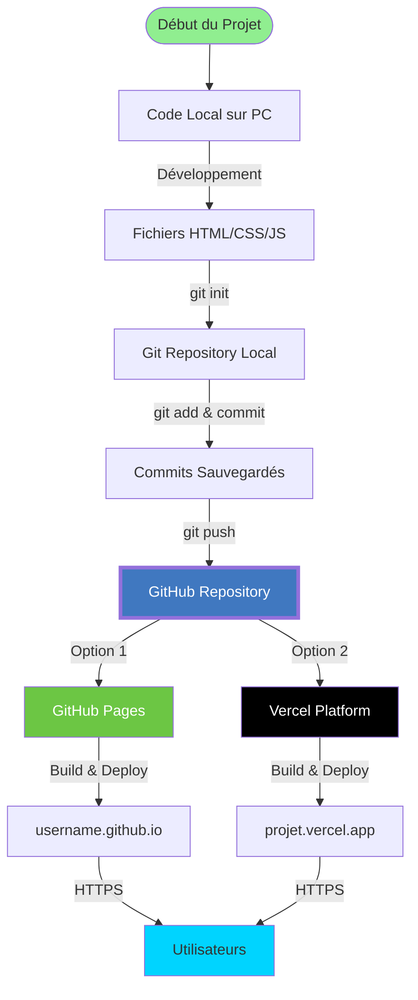

---

## 1. Workflow GitHub Pages

### Architecture Complète

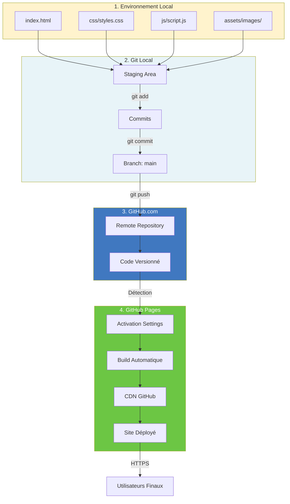

### Séquence Temporelle

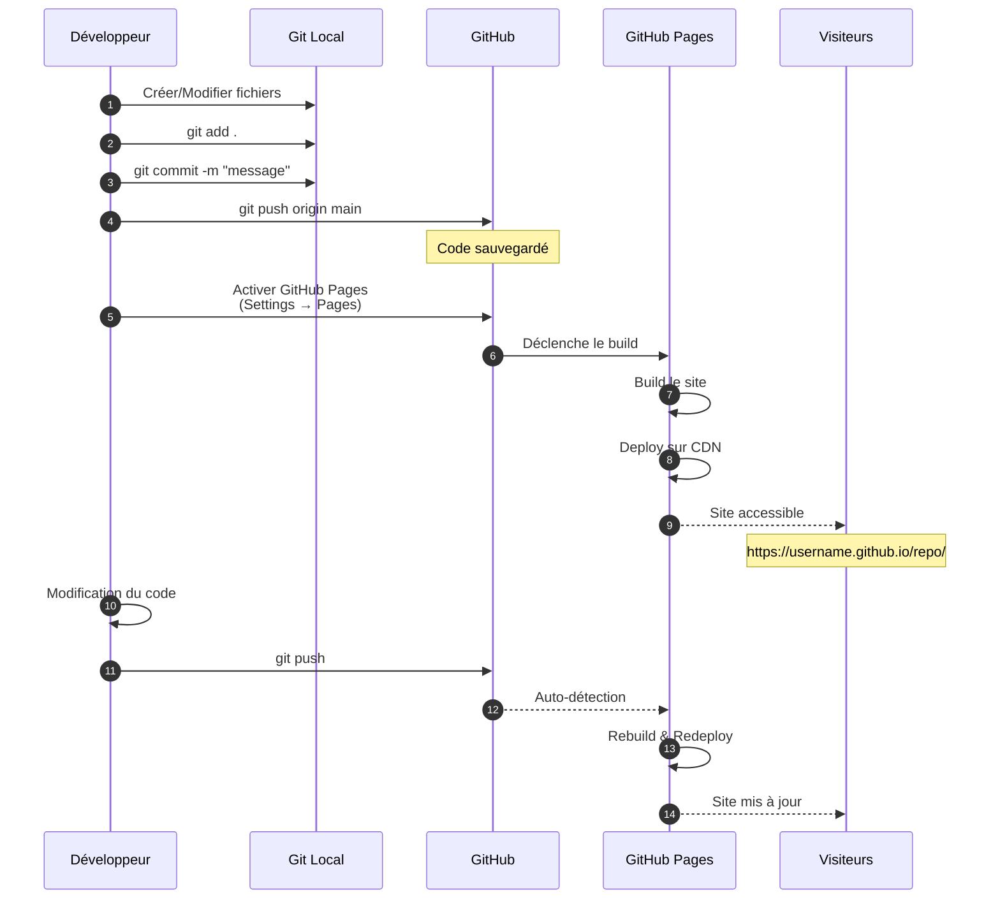

### Cycle de Mise à Jour Continu

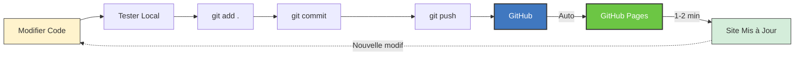

---

## 2. Workflow Vercel

### Architecture avec GitHub au Centre

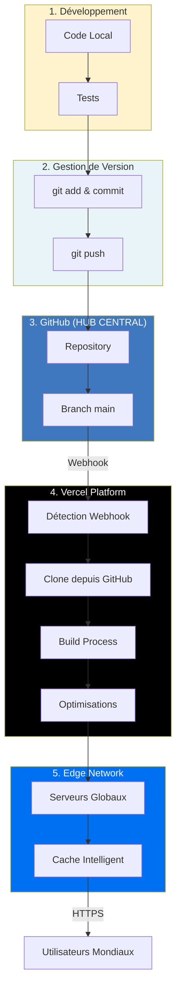

### Séquence Détaillée CI/CD

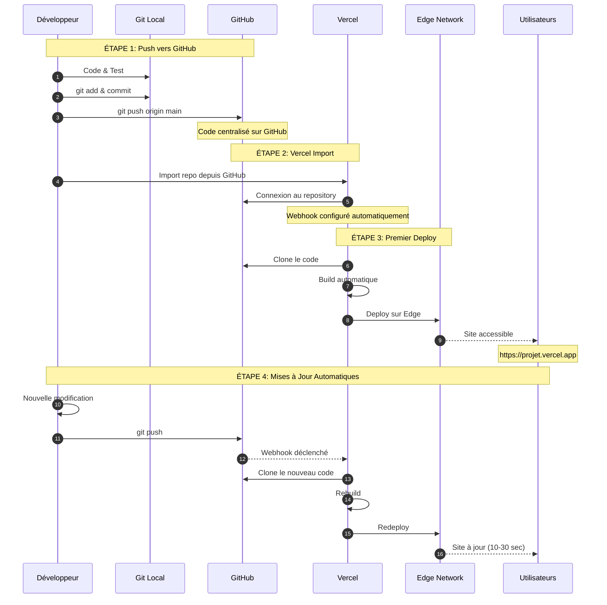

### Comparaison: GitHub Pages vs Vercel

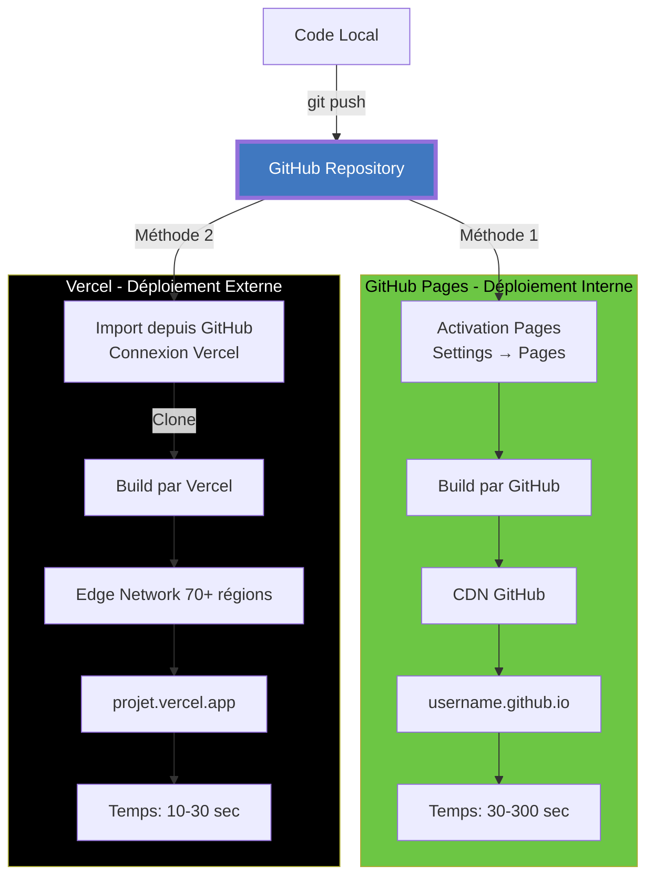

### Workflow de Développement Professionnel

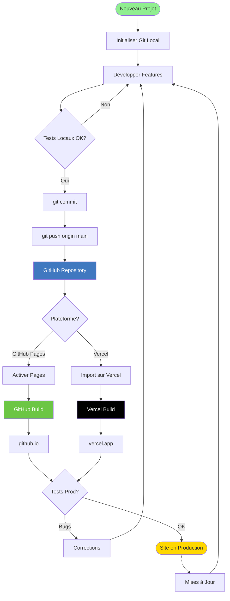

---

## 3. Points Clés à Comprendre

### GitHub est Toujours au Centre

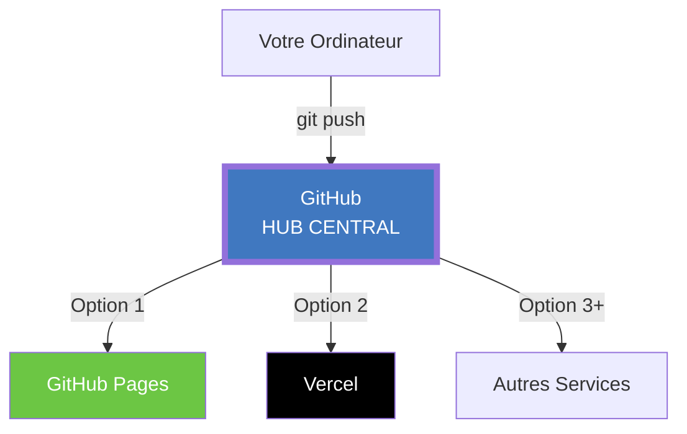

**Pourquoi GitHub au centre?**

1. Contrôle de version
2. Sauvegarde du code
3. Collaboration possible
4. Historique complet
5. Point unique de vérité
6. Compatible avec tous les services de déploiement

---

## 4. Workflows par Niveau

### Débutant: GitHub Pages

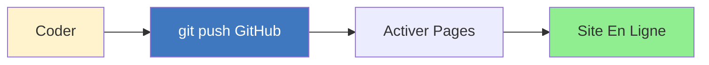

**Simple, gratuit, parfait pour apprendre!**

### Intermédiaire: Vercel

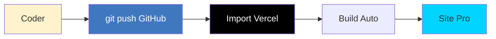

**Rapide, professionnel, avec analytics!**

### Avancé: Les Deux!

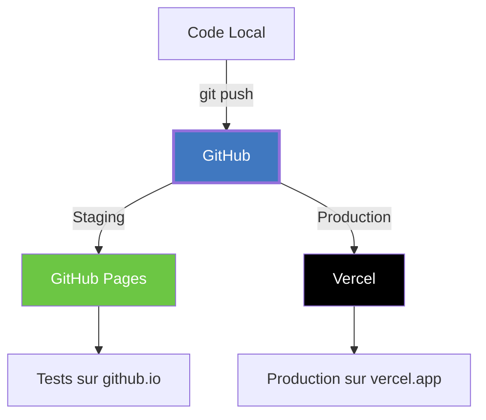

**Utilisez GitHub Pages pour tester, Vercel pour la prod!**

---

## 5. Cycle de Vie Complet d'un Projet

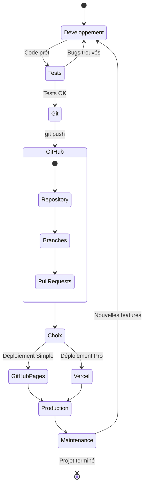

---

## 6. Comparaison Temps de Déploiement

```mermaid
gantt
    title Temps de Déploiement Comparé
    dateFormat X
    axisFormat %S sec
    
    section GitHub Pages
    git push           :0, 2s
    Détection          :2s, 5s
    Build              :5s, 60s
    Deploy             :60s, 30s
    Site en ligne      :milestone, 90s
    
    section Vercel
    git push           :0, 2s
    Webhook            :2s, 1s
    Build              :3s, 15s
    Deploy Edge        :18s, 10s
    Site en ligne      :milestone, 28s
```

**Vercel est 3x plus rapide!**

---

## 7. Architecture Réseau

### GitHub Pages - Infrastructure GitHub

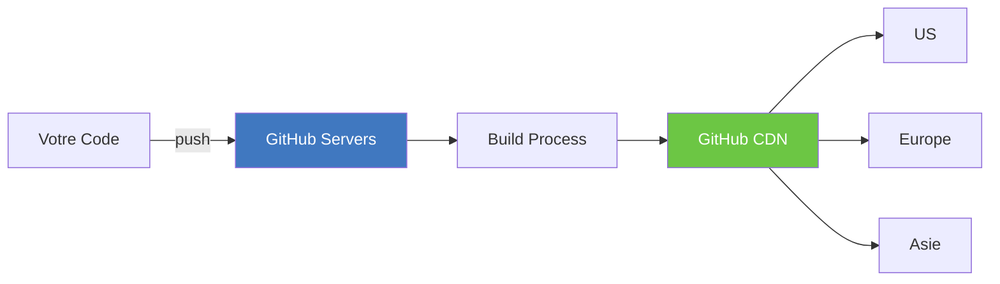

### Vercel - Edge Network Global

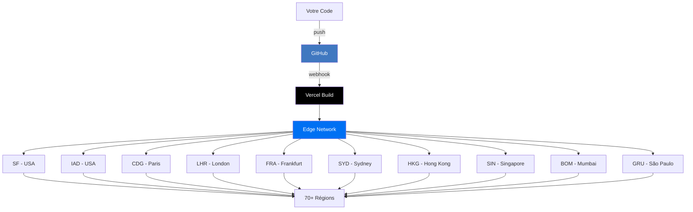

**Vercel: Latence ultra-faible partout dans le monde!**

---

## 8. Workflow avec Branches (Avancé)

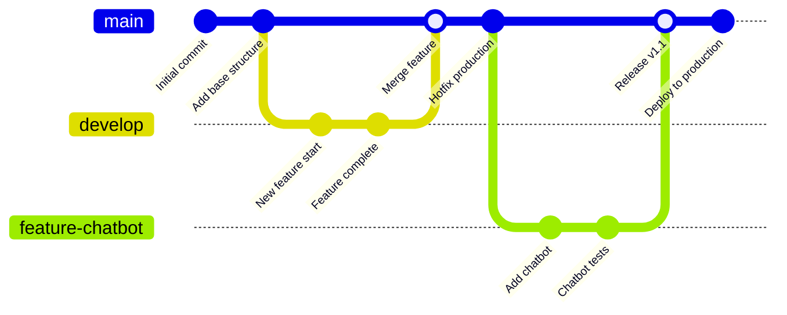

**Chaque merge vers `main` déclenche un déploiement automatique!**

---

## 9. Processus de Preview (Vercel Uniquement)

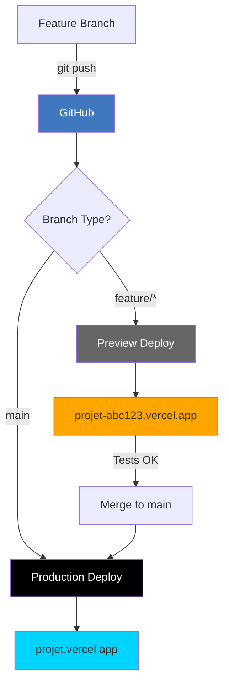

**Chaque Pull Request a sa propre URL de preview!**

---

## 10. Récapitulatif Visuel

### Les 3 Étapes Essentielles

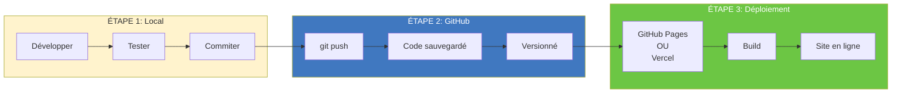

---

## Comment Lire les Diagrammes

### Symboles Mermaid

- **Rectangles** : Processus ou étapes
- **Losanges** : Décisions (choix)
- **Flèches pleines (→)** : Flux principal
- **Flèches pointillées (-.->)** : Flux alternatif
- **Couleurs** :
  - Bleu (#4078c0) = GitHub
  - Vert (#6cc644) = GitHub Pages
  - Noir (#000) = Vercel
  - Jaune (#fff3cd) = Local

### Types de Diagrammes

1. **graph TB/LR** : Diagrammes de flux (Top-Bottom / Left-Right)
2. **sequenceDiagram** : Séquences temporelles
3. **flowchart** : Organigrammes avec décisions
4. **gitGraph** : Historique Git visuel
5. **stateDiagram** : États du projet

---

## Utilisation dans l'Enseignement

### Pour les Professeurs

Ces diagrammes peuvent être:
- Projetés en classe
- Imprimés pour les étudiants
- Utilisés dans les présentations
- Référencés dans les exercices

### Pour les Étudiants

- Dessinez les workflows à la main
- Identifiez chaque étape
- Comprenez le rôle de GitHub
- Visualisez où se trouve votre code à chaque instant

---

## Ressources Mermaid

### Documentation
- [Mermaid Documentation](https://mermaid.js.org/)
- [Mermaid Live Editor](https://mermaid.live/)
- [Mermaid Cheat Sheet](https://jojozhuang.github.io/tutorial/mermaid-cheat-sheet/)

### Outils
- [VS Code Mermaid Extension](https://marketplace.visualstudio.com/items?itemName=bierner.markdown-mermaid)
- [Mermaid Chart](https://www.mermaidchart.com/)

---

© 2024 **Haythem REHOUMA** - Powered by **inskillflow**

**Diagrammes pédagogiques pour visualiser les workflows de déploiement**

---

**Retour à:** [README des Guides](README.md) | [00-START-HERE](00-START-HERE.md)

